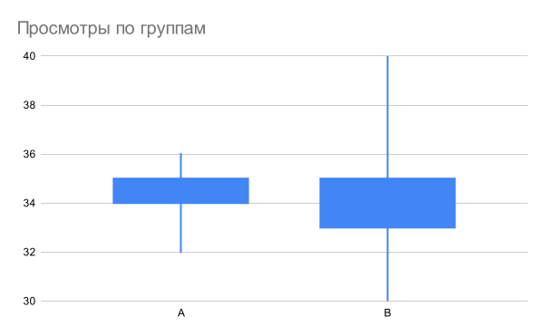
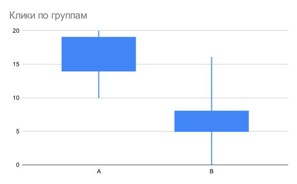

# Описание результата

## Условия

Тестирование алгоритма проведено с помощью синтетического теста со следующими параметрами:
- число слотов: 10
- число групп пользователей: 20
- число баннеров: 15
- количество запросов: 100 000

Вероятность клика составляет 20%, но для баннера 7 для групп 3 / 5 вероятность клика увеличена до 50%.

Запуск теста выполняется командой

```sh
make test-logic
```

Данные генерируются во встроенную базу данных [sqlite](../db/implementation.sqlite).

## Результат

Общее число просмотров 103 000 (при этом 3 000 просмотров создаются при инициализации), результат верный.


Распределение показов нормальное, каждый баннер показан 30-40 раз.


Распределение кликов похоже на нормальное, но имеет правый хвост.

Ожидаем, что у более кликабельных баннеров для определенных групп будет большее число показов и большее число кликов. Выделю группы A (привелегированная) и B (обычная).





Среднее число просмотров для привелегированной группы незначительно выше, возможно нужно больше итераций, чтобы результат был более явным.

Среднее число кликов в привелегированной группе существенно выше.